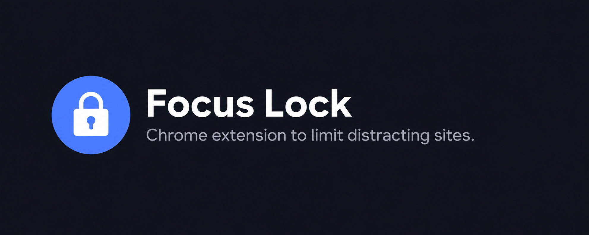
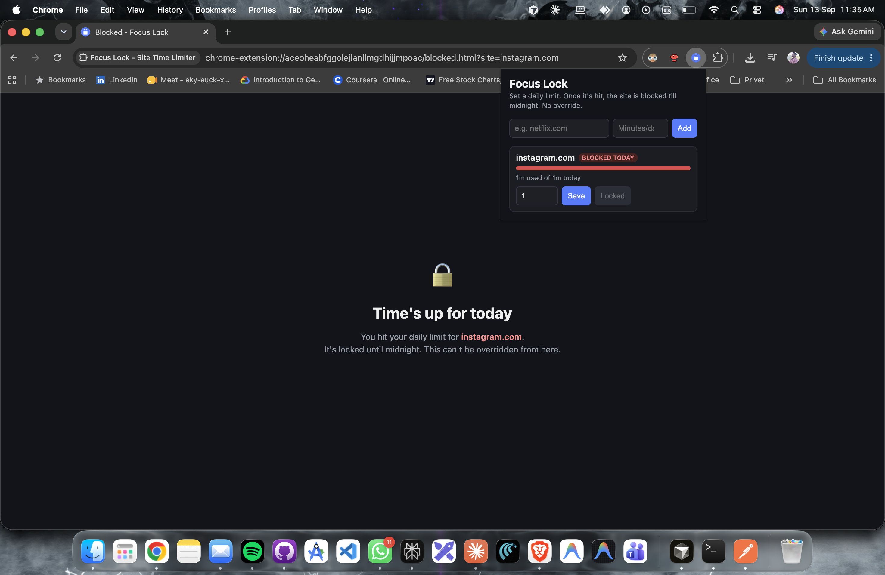
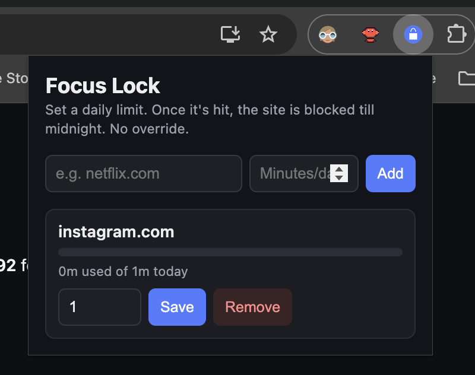

# Focus Lock - Site Time Limiter

A simple Chrome extension I built for myself because I kept opening Netflix, Instagram, and other distracting sites while trying to read or work. It tracks how long you actually spend on the sites you choose, and once you hit your daily limit, that site is **hard blocked until midnight** - no snooze, no override.

## Why I made this

Every "site blocker" I tried had some kind of escape hatch - a 5-minute unlock button, an easy way to raise the limit mid-scroll, or you could just remove the site from the list when you got tempted. That defeats the purpose. Focus Lock is intentionally strict:

- You **cannot raise** a limit once it's set - only lower it
- You **cannot remove** a site if you've already used time on it today
- You **cannot re-add** a site you already added, to "reset" it
- The only way out of a block is waiting for midnight (or uninstalling the extension entirely)

## Features

- Add any site + a daily time limit (in minutes)
- Timer only counts time when the tab is **active and the browser window is focused** - switching tabs or minimizing pauses it
- Once the limit is hit, the site redirects to a locked screen for the rest of the day
- Resets automatically at midnight
- Works in Incognito mode too, sharing the same limits (see setup below)
- No accounts, no external servers - everything stays in your browser's local storage

## Screenshots

> Add your own screenshots here after installing - drag them into the `screenshots/` folder and reference them like below.

```md


```

## Installation

Chrome doesn't allow personal extensions like this to be published without going through the Web Store, so you'll load it manually ("unpacked") - it only takes a minute.

1. **Download this repository**
   - Click the green **Code** button on this repo → **Download ZIP**, or run:
     ```
     git clone https://github.com/<your-username>/<your-repo>.git
     ```
2. **Unzip it** (if you downloaded the ZIP) to a folder you'll keep around - don't delete this folder later, Chrome needs it to keep running the extension.
3. Open Chrome and go to:
   ```
   chrome://extensions
   ```
4. Turn on **Developer mode** - toggle in the top-right corner of the page.
5. Click **Load unpacked**.
6. Select the project folder (the one containing `manifest.json`).
7. The extension should now appear in your extensions list, and you can pin it to your toolbar for quick access.

## Enabling Incognito mode

By default, Chrome blocks **every** extension from seeing or running in Incognito windows - this isn't something an extension can turn on for itself, it's a privacy setting only you can flip. If you skip this step, the extension has no idea Incognito windows even exist, and sites will work normally there - completely bypassing your limits. Here's how to close that gap:

1. Go to `chrome://extensions` (same page as before).
2. Find the **Focus Lock** card in the list.
3. Click **Details** on that card - it's usually a small text link near the bottom-left of the card, next to "Remove." If your window is narrow, widen the browser or zoom out (`Ctrl`/`Cmd` + `-`) until it's visible.
4. On the Details page, scroll down to the section titled **Allow in Incognito**.
5. Switch that toggle **on**.
6. Close any Incognito windows that were already open, and open a new one so the change takes effect.

Once this is on, Incognito windows share the exact same tracked usage and limits as your normal windows - there's no separate "incognito bucket" to reset the clock in.

## How it works (technical overview)

- **`manifest.json`** - Manifest V3 config, declares permissions and the background service worker.
- **`background.js`** - the core engine:
  - Watches the active tab + focused window to know when you're actually on a tracked site.
  - Persists the tracking checkpoint to `chrome.storage.local` (not just an in-memory variable), so time isn't lost when Chrome suspends the background service worker to save battery.
  - Schedules a precisely-timed alarm to fire right when your limit should be hit, rather than only polling once a minute.
  - Redirects blocked sites to `blocked.html`.
- **`popup.html` / `popup.js` / `popup.css`** - the UI for adding sites, setting limits, and viewing today's usage.
- **`blocked.html` / `blocked.js`** - the locked screen shown once a site's daily limit is reached.

## Limitations

- This is a personal-use tool, not audited for security - don't rely on it against a determined adversary (e.g., someone could still disable/uninstall the extension itself; there's no way to prevent that from within an extension).
- Time tracking is per-hostname (e.g. `instagram.com` covers all of `instagram.com` and its subdomains), not per-page.
- Only tested on desktop Chrome. Other Chromium browsers (Edge, Brave) will likely work the same way but haven't been verified.

## License

Use it, fork it, tweak it for your own focus problems. No warranty - if it blocks something you needed, that's kind of the point, but sorry in advance.
